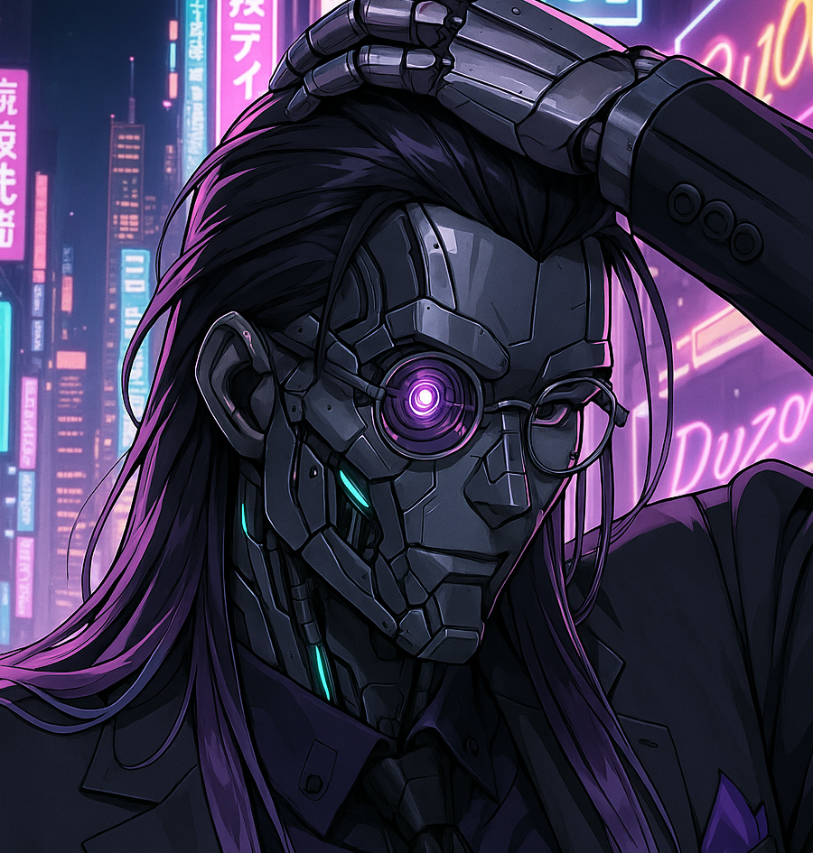

<div align="center">
    <h1>Niflheim-bot</h1>
    <p>A powerful Discord bot that helps manage server events, allowing users to create events, organize team participation, and schedule automatic reminders before events end.</p>
    
</div>

## Run the bot
Create the `.env`, then run the following command (in the project root directory):
```
make
```

## Features
- Create events via DM with detailed prompts.
- Split participants into custom teams with limits.
- Schedule reminders before events end.

### commands:
Commands can be cancelled by answering "cancel".

`/event create`
- Starts a DM conversation with the user to gather event data.
- Posts the message in the original channel with these elements:
    - Time details
    - Teams and participants
    - Join buttons for each teams

`/event remind`
- Starts a DM conversation with the user to gather reminder data.
- Posts the reminder in the original channel in due time.

### Persistance:
App state (events, reminders etc.) is persisted in a [redis](https://github.com/redis/redis) database.
See the key structure:
- {guild_id}:event:{event_id}:data      → event hash
- {guild_id}:event:{event_id}:teams     → set of team IDs
- {guild_id}:team:{team_id}:data        → team hash
- {guild_id}:team:{team_id}:members     → set of user IDs (provided by discord)
- {guild_id}:reminder:{id}:data         → reminder hash

Most keys expire after 30 days. Meaning that buttons and other components won't work after 30 days.
